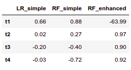

# Time Series Forecasting

Being able to forecast your data accurately is an essential skill nowadays. Getting the trend right is not enough, you need to be able to predict future values with a very low margin error. This repo addresses this situation, we will see how using a complex model instead of a simple linear regression we can improve our predictions without impairing the processing time significantly.

## :deciduous_tree: Let's grow some trees

The idea behind this implementation was to improve an already existing predictive model. The original model worked ok with datasets that didn't exhibit any seasonality but failed to predict seasonal time series. This problem was solved by implementing a new Random Forest Regressor model.
Here we can see how the new model (green line) better fits the data.

  

## :boom: Feature engineering, is it worth it?

Short answer, yes. It's clear that complex algorithms will perform better than simpler ones (some exceptions apply), however, one must not forget that feature engineering is the tool that gives us a performance edge. Data science is not just about using the most convoluted algorithms, it is about understanding the data and spotting not-so-obvious patterns to create new features that will improve any model's performance. The next two charts set side by side the same Random Forest model with and without feature engineering.

  

This case's feature engineering was simple, but, got the job done. Added columns were the following: 

- first and last day of the month.
- weekdays, values ranging from 0 to 6, where 0 is Monday and 6 Sunday.
- day of the month, values ranging from 1 to 31.

  

After running the model for 4 different datasets and computing the R2 error metric we got the following results:

Notice that the Random Forest outperforms the Simple Linear Regression in the last 3 examples, however, when the data behaves like a line, you are better off using a Simple Linear Regression.

  

Check all datasets either by downloading and running the notebook or just by heading to the charts folder.

## :computer: Technology stack
Written in python 3. Main modules:

**Pandas** -> Data manipulation, cleansing and analysis.

**Scikit-Learn** -> Forecasting.

**Matplotlib** -> Charting and visualization.

## :information_source: Data info
There are 4 different datasets available in the data folder (t1, t2, t3, and t4). Each one is comprised of two columns; **date** and **value**.

  

  

## :love_letter: Contact info
Doubts? Advice?  Drop me a line! :smirk:

